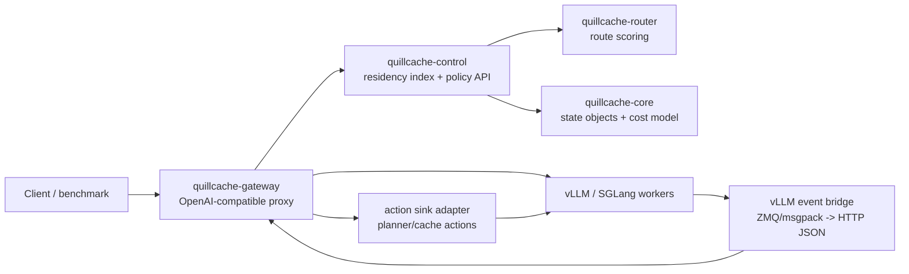

# QuillCache Architecture

QuillCache is scoped as a control plane for inference state, not as a model
runtime. The first boundary is a KV block object model that is independent from
any single engine implementation.

## Runtime Topology



## State Objects

The core state object is `KvBlockKey`:

- `model_id`
- `tokenizer_id`
- `adapter_id`
- `tenant_id`
- `prefix_hash`
- `block_hash`
- `block_index`
- `token_count`

The identity is intentionally stricter than `block_hash` alone. KV cache reuse is
only valid when the model, tokenizer, adapter, and tenant policy agree.

## Routing Loop

For each request, the gateway builds a `RequestShape` from request metadata and
optional `quillcache` block hints. The control plane now builds a `RequestPlan`
around the router decision. The plan records the serving mode, execution worker,
optional prefill worker, decode worker, and per-block actions.

The router evaluates candidate workers and block-level choices:

1. use a local HBM hit
2. transfer a block from another worker or tier
3. recompute the block with prefill

The first router is greedy and cost-model based. It is not the final research
claim; it exists to make baselines and traces executable.

## Runtime Planner And PD Roles

`EngineEndpoint.role` is `Aggregated`, `Prefill`, or `Decode`. Existing configs
default to `Aggregated`. In a PD fleet the planner routes decode work only to
decode-capable workers. If a decode worker needs recompute work and a
prefill-capable worker exists, the `RequestPlan` becomes `Disaggregated` and
emits `RunPrefill` actions.

The gateway proxies the OpenAI request to `execution_worker_id` and exposes the
plan through headers:

- `x-quillcache-mode`
- `x-quillcache-prefill-engine-id`
- `x-quillcache-decode-engine-id`
- `x-quillcache-planner-actions`
- `x-quillcache-cache-actions`
- `x-quillcache-action-sink`

This is a real runtime control-plane plan. With `action_sink.kind: http`, the
gateway also POSTs the plan to an external adapter before forwarding the OpenAI
request. The internal vLLM/SGLang prefill handoff and tensor transfer still
belong to the adapter, not to the Rust gateway.

## Runtime Tiered Data Plane

`DataPlane` is now a runtime trait, not only a simulator concept. The default
`NoDataPlane` keeps inferred placement behavior. `TieredDataPlane` manages
in-process HBM/DRAM/SSD tiers and returns admission, hit, promotion, demotion,
eviction, and remove actions.

When placement or KV events change tier state, `ControlPlane` mirrors the final
data-plane state into the `IndexBackend`, so `/v1/state` shows both index
residency and data-plane residency.

## Runtime Action Sink

The action sink is the execution seam between QuillCache policy and engine/data
plane mechanics. It receives:

- `planned` events before the request reaches the engine, including full
  `RequestShape` and `PlanAction` records (`UseLocal`, `Fetch`, `RunPrefill`,
  `Recompute`, `Decode`).
- `committed` events after successful upstream execution, including
  `DataPlaneAction` records (`Admit`, `Promote`, `Demote`, `Evict`, `Remove`).

`fail_open: true` keeps the gateway available when a research adapter is down.
`fail_open: false` is for adapters that must complete transfer/prefill before
decode can proceed.

## Residency Index Boundary

The index boundary is the single trait `quillcache_core::IndexBackend`. Backends
implement it depending only on `quillcache-core`. The gateway, control plane, and
router depend on the trait, never on a concrete storage engine.

`quillcache-control` translates KV events into residency updates through the
backend-agnostic `ingest_batch(&mut dyn IndexBackend, ...)`, so identity
resolution (model/tokenizer/adapter/tenant) happens once and every backend sees
the same `put` / `remove_block` / `clear_worker` calls. `ControlPlane` holds a
`Box<dyn IndexBackend>` and can be constructed with `with_index(...)` to swap
backends at runtime.

The v0.1 backend is `MemoryIndex`, which keeps:

```text
KvBlockKey -> Vec<CacheResidency>
```

`IndexBackend` is identity-aware (`IdentityScope`), supports an identity-scoped
`prefix_scan` (the ART/radix strength), and reports comparable `IndexMetrics`
(including `bytes_written` for write-amplification studies and a `persistent()`
flag for recovery studies).

The persistent ART backend is Holt. Holt stores prefix/residency metadata and
recovery state. It is not the component that moves KV tensors between GPU, DRAM,
SSD, or remote memory. That responsibility belongs to the inference engine and
data-plane connectors.

This split leaves room for ART-vs-LSM research: Holt and a RocksDB baseline
implement the same `IndexBackend` trait while the gateway, event ingest, and
router stay unchanged.

## MVP Gateway

The gateway currently exposes:

- `POST /v1/chat/completions`
- `POST /v1/completions`
- `POST /v1/kv-events`
- `GET /v1/state`
- `GET /healthz`

The proxy endpoints are OpenAI-compatible and forward requests to the selected
engine. The gateway strips the optional `quillcache` request object before
forwarding. This lets benchmarks provide exact block hashes while keeping the
upstream vLLM/SGLang request clean.

`GET /v1/state` returns configured engines, worker state, index stats,
data-plane stats, action-sink config, data-plane residency, and the current
index residency snapshot. This endpoint is intentionally simple because v0.1 is
a research prototype, not an operator UI.

The event ingest endpoint accepts a vendor-neutral JSON shape compatible with
vLLM's KV event concepts: block stored, block removed, and all blocks cleared.
The included Python bridge subscribes to vLLM's ZMQ/msgpack event stream and
posts those events into this endpoint.

## Future Connector Boundary

The connector layer should be thin:

- observe KV block creation and eviction events from an engine
- inject reusable blocks back into the engine KV manager
- expose transfer metadata for disaggregated prefill/decode
- consume gateway action-sink events and return 2xx only after required
  prefill/fetch work is ready
- keep engine-specific layout details outside the router

Initial integration targets should be vLLM or SGLang via existing connector
paths rather than a custom inference engine.
